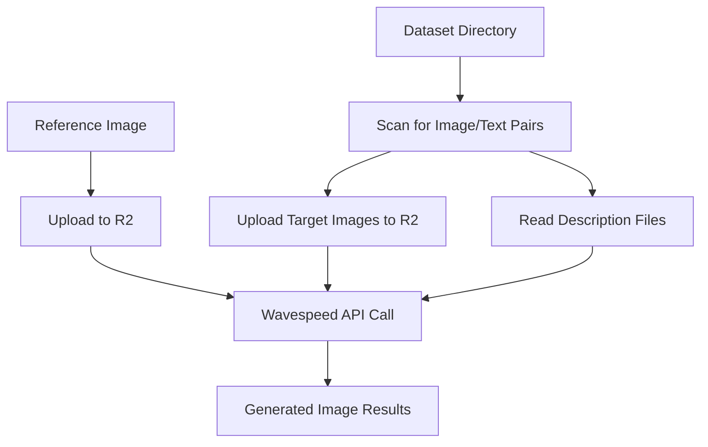

# AI Image Processing Pipeline

## Overview
This pipeline processes a dataset of images by swapping faces from a reference image into target images using AI generation via the Wavespeed API.

## Pipeline Flow



## Step-by-Step Process

### 1. **Input Preparation**
- **Reference Image**: A single image file containing the face to be swapped
- **Dataset Directory**: Contains pairs of:
  - Image files: `name.jpg`, `name.jpeg`, or `name.png`
  - Description files: `name.txt` (corresponding text descriptions)

### 2. **File Discovery & Validation**
```python
# The pipeline scans the source directory and:
# - Identifies all image files (.jpg, .jpeg, .png)
# - Matches them with corresponding .txt description files
# - Skips images without matching descriptions
```

### 3. **Upload to R2 Storage**
- **Reference image** → Uploaded once and cached
- **Target images** → Each uploaded individually with caching
- **Returns**: Presigned URLs for API consumption

### 4. **AI Processing via Wavespeed**
For each image pair, the pipeline:
- Sends API request with:
  - `images[0]`: Target image URL
  - `images[1]`: Reference image URL  
  - `prompt`: Description text from .txt file
  - `size`: "3072*4096"

### 5. **Generated Results**
- Receives processed images with face swapped from reference
- Results stored in `responses` array for further processing

## Directory Structure
```
source_directory/
├── portrait001.jpg     # Target image
├── portrait001.txt     # Description for portrait001
├── portrait002.png     # Target image  
├── portrait002.txt     # Description for portrait002
└── ...
```

## Usage Example
```python
from utils.image_generator import ImageProcessorPipeline

# Initialize pipeline
processor = ImageProcessorPipeline(
    source_dir="/path/to/dataset",
    reference_image_path="/path/to/reference.jpg"
)

# Process all images in dataset
await processor.process_images()
```

## Key Features
- ✅ **Automatic file pairing**: Matches images with descriptions
- ✅ **R2 caching**: Prevents re-uploading same files
- ✅ **Error handling**: Skips problematic files and continues
- ✅ **Progress tracking**: Visual feedback during processing
- ✅ **Batch processing**: Handles multiple image pairs efficiently

## Requirements
- Wavespeed API key (`WAVESPEED_API_KEY`)
- R2 storage credentials (`R2_BUCKET_NAME`, `R2_ACCOUNT_ID`, etc.)
- Python dependencies: `aiohttp`, `boto3`, `termcolor`, `tqdm`